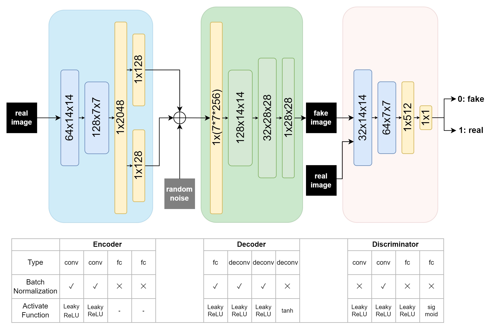

# GANs 

## Scope: Implement simple GAN models for Image generating

## Input: 
- Training on MNIST dataset (with label 2 only)

## Output:
- An image with digit number 2

## How to run:
This project contains 2 jupyter notebooks: <code>DCGAN.ipynb</code> and <code>VAE_GAN.ipynb</code>. Simply run the notebook with the desired model. 

## Models:

### DCGAN
    - Paper: https://arxiv.org/pdf/1511.06434

Architecture of models:

### VAE-GAN:
    - Paper: https://arxiv.org/pdf/1512.09300
    - Reference code: https://github.com/rishabhd786/VAE-GAN-PYTORCH

Architecture of models:

## Requirements 
For required environement to run the Notebook, please check file <code>**requirement.txt**</code>
